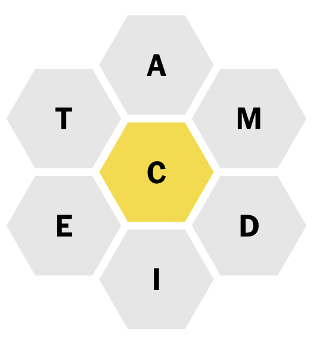

# NYT Spelling Bee Aide

Generates crossword-style hints for the New York Times Spelling Bee game.

For example, given the following problem:



The NYT Spelling Bee Aide will produce the following hints:

```
1. AB. Academic endeavours. (8)
2. AC. Demonstrating excellence in a subject. (7)
3. AC. Did exceptionally well on a test or task. (4)
4. AC. Chemical compound used in various products. (7)
5. AC. Sour in taste. (4)
6. AC. Pinnacle or height of success. (4)
7. AC. Performed in a play or film. (5)
8. AD. A person with a strong inclination towards a particular habit or activity. (6)
9. AD. Having a strong dependency on a particular substance. (8)
10. AT. Small, often enclosed space in the roof of a house. (5)
11. CA. Golfer's assistant who helps carry the clubs. (6)
12. CA. Trainee in the military. (5)
13. CA. Arrived at a location. (4)
14. CI. Quote or refer to as evidence. (4)
15. CI. Referred to a source in a written work. (5)
16. DE. Ten years. (6)
17. DE. Dishonesty or deception. (6)
18. DE. Make a choice or come to a conclusion. (6)
19. DE. Settled firmly on a course of action. (7)
20. DE. Committed to a particular task or cause. (9)
21. DE. Committed oneself to a particular activity. (9)
22. DE. Discovering or identifying something. (6)
23. DE. Discovered the presence of something. (8)
24. DI. Small cubes with dots on each face, used in games of chance. (4)
25. DI. Cut into small cubes. (5)
26. DI. Command or order with authority. (7)
27. DI. Ordered someone to do something. (8)
28. ED. Official proclamation or command. (5)
29. IC. Covered with ice. (4)
30. MA. Nut of a tropical tree. (9)
31. MA. Ceremonial staff or club. (4)
32. ME. Relating to religious doctrine or teaching. (5)
33. ME. Organization providing healthcare for those with low income. (7)
34. ME. Administered medication. (8)
35. MI. Small rodents known for being prolific breeders. (4)
36. MI. Imitating something or someone. (5)
37. TA. Understood without being directly stated. (5)
38. TA. Poised and diplomatic in one's approach. (4)
39. TA. Strategy or plan for achieving a specific goal. (6)
```
